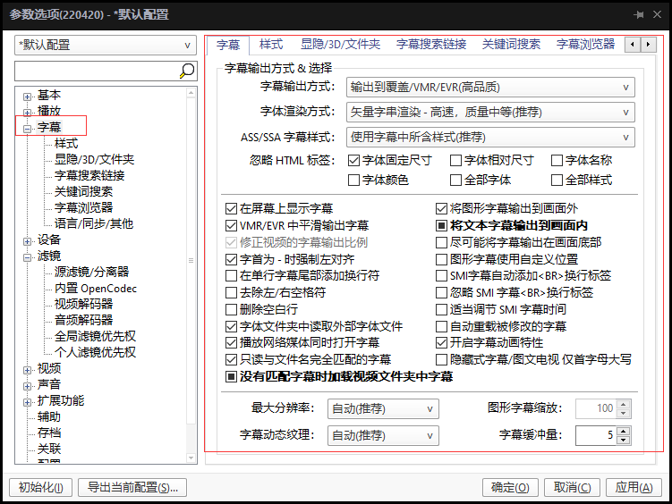

# 如何观看特效外挂字幕（点击有颜色的字体能跳转到下载界面）

这里说的是我自己用的方法，感谢同僚**WeissP**教我  
首先我们需要准备一个播放器，名字叫做 **[potplayer](https://pan.baidu.com/s/1gf1XQLl)**  
然后把**对应（32位/64位）版本**的 **[特效插件](https://github.com/computerfan/VSFilterMod/actions/runs/2402841300)** 放进**PotPlayer的安装目录**里  
之后再将一个 **[小东西](https://pan.baidu.com/s/1dFhdmQ9)** 放到**PotPlayer的安装目录**里运行（记得用管理员运行哦）  
完成后打开**PotPlayer-选项-滤镜-全局滤镜-添加外部滤镜**（如下图）  
  
然后把特效插件**VSFilterMod**选中-确定出来后得到两个滤镜选项，如上图**勾选**（下图**蓝框**）-选择强制使用（下图**红框**）。**注意：如果有别的滤镜一定要保证这两个滤镜在最顶部**  
  
接下来选择**字幕选项**，并按下图勾选选项保持与图中一样设置  
  
应用后就可以点击**应用/确定**结束设置了，这时打开live视频，当右下角任务栏通知出现下图小箭头就代表设置成功了  
  
此时双击小箭头，弹出设置框，点击下图所示**Open**...选择要加载的字幕文件然后**应用/确定**即可观看特效字幕  
