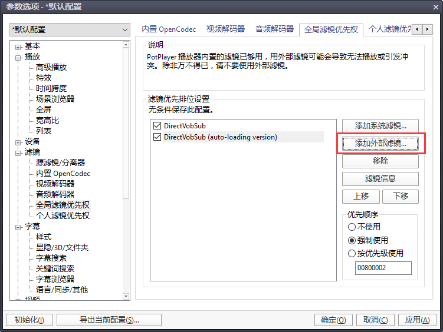
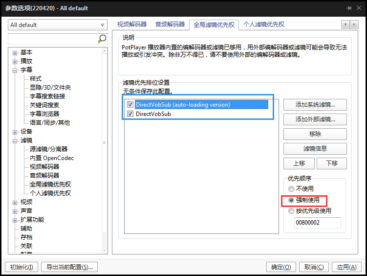
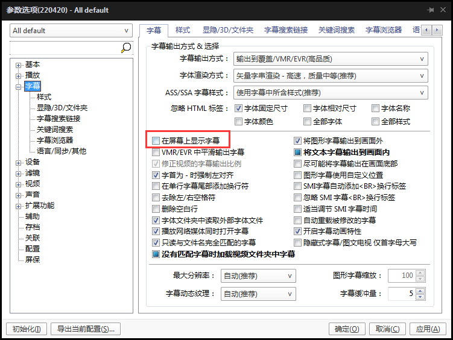
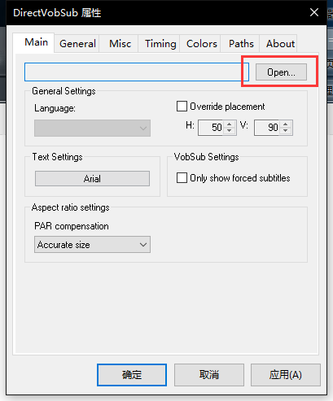

# 如何观看特效外挂字幕（点击有颜色的字体能跳转到下载界面）

这里说的是我自己用的方法，感谢同僚**WeissP**教我

首先下载播放器 **[PotPlayer](https://pan.baidu.com/s/1gf1XQLl)**

然后把**对应（32位/64位）版本**的 **[特效插件](https://github.com/computerfan/VSFilterMod/actions/runs/2402841300)** 放进**PotPlayer的安装目录**里

之后再将一个 **[小东西](https://pan.baidu.com/s/1dFhdmQ9)** 放到**PotPlayer的安装目录**里运行（记得用管理员运行）

完成后打开**PotPlayer-选项-滤镜-全局滤镜-添加外部滤镜**（如下图）

然后把特效插件 **VSFilterMod.dll** 选中-确定出来后，得到两个滤镜选项。依次选中左侧列表中的每个选项（下图**蓝框**），选择强制使用（下图**红框**）。使用**上移**按钮将 (auto-loading version) 的版本移动到最上面。**注意：如果有别的滤镜，一定要保证这两个滤镜在最顶部**

接下来选择**字幕选项**，将PotPlayer自带的字幕功能关闭（取消勾选红框选项）。否则两者会冲突互相覆盖：

应用后就可以点击**应用/确定**结束设置了，这时打开live视频，当右下角任务栏通知出现下图小箭头就代表设置成功了

如果提前把字幕文件改成和视频文件名称一样（除了后缀），应该会自动加载字幕。

如果没有，此时双击小箭头（如果无反应，可用 PotPlayer画面上右键-滤镜-DirectVobSub-属性(滤镜)...），弹出设置框，点击下图所示**Open**...选择要加载的字幕文件然后**应用/确定**即可观看特效字幕

